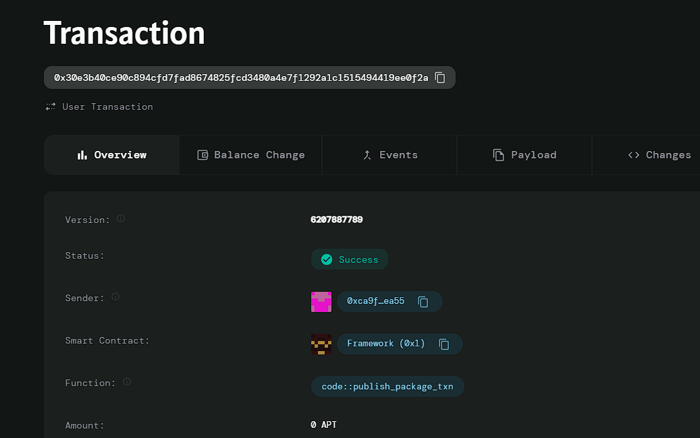

# Project Title
Insurance Policy Automation

# Deployed ID: 0x30e3b40ce90c894cfd7fad8674825fcd3480a4e7f1292a1c1515494419ee0f2a

# Project Description
A smart contract that streamlines the issuance and management of insurance policies. It automates premium payments, policy renewals, and claim processing, ensuring faster response times. The contract can integrate external data feeds (oracles) to verify claims automatically, reducing the need for manual intervention and improving customer experience.

# Project Vision
The vision of this project is to create a seamless insurance experience for both insurers and policyholders. By leveraging blockchain technology, we aim to ensure transparency, efficiency, and reliability in insurance policy management.

# Key Features
- **Automated Premium Payments**: Enables policyholders to make premium payments directly through the smart contract.
- **Policy Issuance**: Simplifies the process of issuing new insurance policies.
- **Integration with Oracles**: Plans to integrate with external data feeds for automatic claim verification.
- **User Ownership**: Each policy is owned and managed directly by the policyholder.
